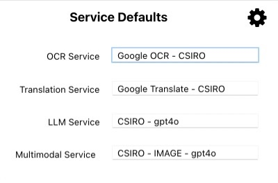
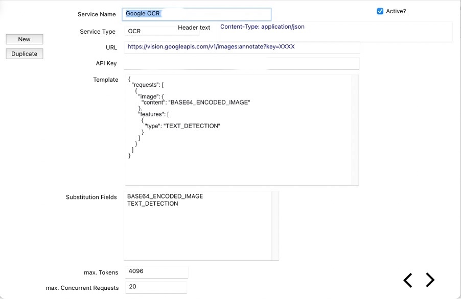
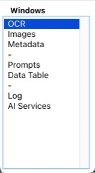

Collaborative Collections Metadata Extraction Tool – SpeciMate
## SpeciMate User Guide

# Introduction

This document describes how to set up and use **SpeciMate** – the Specimen Collections Metadata Extraction Tool – to process digitised specimen images and extract the label metadata into named columns (or entities). These can then be checked and edited in a data curation process before exporting a complete dataset in tabular format, ready for further data quality curation and importing into your collection database.

# Quick Start Guide

## Installation

* Download the SpeciMate.zip application as a compressed file (.zip) from the /binaries folder according to your platform.
* Extract the application to a location with write permissions.
* Copy the contents of the /Data folder and other data (see platform details below) to the same location as the application.

## Basic Usage

### Processing

* Select a folder containing specimen images and select 1 or more to process.
* Choose the *specimen type* from the dropdown menu.
* Select processing options (OCR, Translation, Metadata Entity Extraction).
* If Metadata entity extraction selected, then:
  + Select an AI model to be used for Metadata entity extraction (if applicable).
  + Open the prompt library and select a suitable prompt for the specimen type.
* Click '*Process*' to begin.

### Curation

* Select a pre-processed folder of specimen images.
  + Open OCR data file and Metadata file when prompted.
* Select specimen type.
* If re-processing specimen entity extraction to be done, then:
  + Select an AI model, as above.
  + Select prompt, as above.
* Select “Curate” button from main (blue) menu control to open image and metadata windows.
* Edit metadata for each specimen.
  + navigate between fields using tab.
  + next/prev specimen using up/down arrows.

# Setup

You will receive/download the SpeciMate application as a compressed file (.zip). You can place this anywhere on your system, but it should be where you have user permissions to write to. Double click the file to extract the application data. Depending on your system (PC or Mac), the file layouts should be as below.

## Windows

Figure 1 Windows application and folder setup.

## MacOS

Figure 2 MacOS application and folder setup.

Inside the */Data* folder is the key application program called *OCR.livecode*. This contains all the working code for *SpeciMate*, while the application program itself is just a wrapper for that main functionality. This allows us to more easily provide customisation and updates by distributing a new *OCR.livecode* file rather than a completely new application.

## Pre-processing

Before using this software, there are some pre-processing steps that may be necessary.

* Ensure the specimen images are:
  + JPEG format
  + < 5 MB in size, though even 1 MB or less should still work ok for OCR of most specimens.

See Appendices for more info.

# Main Processing Screen

The main processing screen provides the core selection and setup functionality for extracting the metadata from a folder of specimen images. As described in the Quick Start Guide, you basically follow these steps for batch processing and subsequent interactive data curation:

## Processing

* Select a folder containing specimen images (see *Select Folder*).
* Choose the specimen type from the dropdown menu (see *Select Specimen Type)*.
* Select processing options (OCR, Translation if needed, Metadata Entity Extraction – see *Processing a folder of specimens*).
* If Metadata entity extraction selected, then:
  + Select an AI model to be used for Metadata entity extraction (if applicable) – see *Select AI model*.
  + Open the prompt library and select a suitable prompt for the specimen type – see *Prompt selection*.
* Click **'Process'** to begin.

## Curation

* Select a pre-processed folder of specimen images (if not already open).
  + Open OCR data file and JSON Metadata file when prompted.
* Select **specimen type.**
* Select “**Curate**” button from main (blue) menu control to open image and metadata windows.
* Edit metadata for each specimen (see *MetaData Curation*).
  + navigate between fields using tab.
  + next/prev specimen using up/down arrows.
* If re-processing specimen entity extraction is desired, then you will also need to:
  + Select an AI model, as above.
  + Select prompt, as above.
  + Ensure “Extract Entities” selected in processing options.

### Select Folder

To process a folder of specimen images you select a folder of images and the type of specimen.

Select a folder containing specimen images by clicking on the folder field. You will be asked to:

1. Select the OCR data file, if previously processed (look for *metadata\_OCR.bin* or similar). Select Cancel if not available.
2. Load the extracted entities (metadata), if previously processed. Select the metadata file, if available (look for *NER\_GPT.JSON or similar*).

Note. Cancel for either file will load no prior data which may be useful for enabling different versions. E.g. if testing different OCR or language models.

### Select Specimen Type

Select a specimen type from the dropdown menu below the folder.

* Herbarium sheet
* Insect Slide
* Insect Type
* Tabular data e.g. Marine survey data forms
* *Cryptogam – TBD*
* *More to come…*

Figure 3 Main application window showing all setup and processing options.

## Processing a folder of specimens

Selecting the *Test* or *Process* items from the menu on the left of the screen will show the process box (as below). There are 3 main processing options. All 3 can be selected if required and they will run sequentially for each image selected. You can select 1 or more images to process from the file list. *Note* that you will need an internet connection as all processes are online services.

*TIP: Hold the Control key down when clicking the Process button to process all the images in the list. (But test first, if needed.)*

Figure 4 Process selection and status. This shows OCR and Extract Entities selected for processing. 515 out of a total of 1527 specimens have already been processed by both process types in this folder.

* Select whichever processes you wish to run:
  + OCR
  + Translation
  + Extract Entities
* You can select all 3 at the same time which will be faster than selecting each individually. *Note that while these processes run sequentially for each file, multiple files are processed at once to improve performance. You can view more details in the Log window.*
* The process will run on all selected files in the file list field. To process **all** files in the list, hold the *Control* key down when clicking the *Process* button.
* Translation may be necessary for some foreign language specimens. The checkbox “*Use translation?*” will use the results of the translation when performing entity (or data column) extraction.

Figure 5 Processing flow overview.

Processing progress will be seen in the progress bars to the right of each process checkbox. You can also view the processing log by opening the *Log* window.

*Note* that the order of processing is: 1. OCR 2. Translation 3. Extract Entities. Translation is optional, but OCR must be performed before any other process can run. All can be selected at once and the correct process order will be followed automatically.

## OCR

This uses Google Vision OCR services and requires a network connection. This has limits on filesize so requires that images are reduced in filesize from the originals. Ideally < 5MB JPEG format while <1 MB also works fine in testing. See the Appendices for scripts, if required.

## Translation

Translation is performed using the Google Translate service and requires a network connection. Translation will only be performed when the OCR process recognises a foreign language in the text it extracts and also that the amount of foreign text is > a smallish % of the total (eg. 15%). So you can select this

## Metadata Entity Extraction

Metadata entity extraction currently uses Large Language models (initially from openAI) to extract named entities, or data items, from the specimen text that has been extracted from the specimen image using the OCR and translation processes.

Anytime you will be running the entity extraction, you should select the model of choice and select (and edit, if necessary) the prompts you want to use. When you’re curating the resulting metadata, you should also ensure this has been done before re-running this process.

### Select AI model

Select the AI model (LLM) that will be used for extracting the desired entities. The available models must be setup prior to selection (See the section on “Services Selection and Setup”).

* *GPT-4o-mini*: good, fast, cheap.
  + *GPT-4o*: very good, fast, med. cost.

Here you have an option to choose a multimodal model or not. If you select the “Multimodal?” checkbox, the available models in the dropdown menu will change to reflect this. What does this mean for you? Briefly, it may be useful in some cases and can perform all processes in one call. See below for more info.

* *Exclude text from entity extraction?*
* If desired, check the box and enter lines of text from the OCR process that should be excluded from the extraction process. These might include terms from scale or colour bars or any other terms that are unneeded.
* **Caution**: *be careful of entering single words or characters that will be excluded from everywhere in the text.*

#### Multimodal model

A multimodal model can process images as well as text. In this case, we have the option to perform all of OCR, translation and entity extraction in one single pass using a single AI multimodal model. The immediate effect here is that we do not then run the OCR and translation processes, and we also are not able to exclude text from the entity extraction process.

Currently this could be a good option for specimen images without difficult handwriting and/or using relatively standard languages. It can also be a good option for handling pictograms, such as gender symbols.

### Prompt selection

Using the right prompt is crucial to getting good results from the entity extraction process. Each type of specimen image will need a custom prompt and there are some provided. You can customise some parts of the prompts to refine your extraction processes. Especially useful here can be data formatting options or other explanatory text regarding the current specimen images.

* *Role*, *Prompt* and *Example* fields contain text that effectively controls how the AI model acts on the text that is supplied to it. We can modify these during the setup and test phases to refine them for use within a batch.
* The *Role* and *Prompt* should generally remain the same for a project but can be experimented with to achieve desired outcomes.
* **NOTE** that the *Columns* field contains column names and should only be changed after consulting with the developer.
* You can **save** the current settings for these prompt-related field using the disk icon.
* You can select from **previously used prompts** using the list icon to the left of the Prompt field. This will bring up the Prompts window for browsing and prompt selection. See **Prompt Management.**

### Prompt Customisation Examples

Parts of the prompt can be customised, both in the main window and in the prompts window. Edits in the prompt window will be automatically saved to the current prompt, while edits in the main window will need to be saved and will be saved as a new prompt.

Useful ideas to explore here are formatting options for data items.

Date examples:

* YYYY-MM-DD -> 1987-04-25
* DD-Mon-YYYY -> 25-Apr-1987
* Instruction example: *Convert any dates to DD-Mmm-YYYY or Mmm-YYYY or YYYY depending on the data supplied.*

# View Specimen Image

To view any specimen image from the main window, either:

* Double-click on an image name in the list of images; or
* Select “*Curate*” from the main menu (in blue) on the left of the main screen; or
* Open the control panel and select “*Images*”.

### Zoom/move/rotate/reset

Use the mouse scroll wheel to zoom in and out. Alternatively double-click to zoom in, shift-double-click to zoom out.

Hold the mouse button down and move the image.

**Reset** the image using the  button to return to original scale with no rotation.

**Rotate** the image 90º using the  button. Shift-click to rotate in the other direction.

Display OCR text by showing textboxes/textblocks and hovering over each of them. *(NB Google has changed something recently so this is not working correctly).*

Figure 6 Image of herbarium specimen

# MetaData Curation

After processing or loading a set of specimen data in a folder and selecting the specimen type (as outlined here: *Select Folder* and *Select Specimen Type*), you should check and edit the resulting data to ensure it is the quality you’re expecting. As the prior processes are not always 100% correct, we need to add our knowledge and skills to ensure the data are of high quality.

Figure 7 Specimen data curation workflow.

To display the metadata curation screens, select “*Curate*”  from the main screen. This will open both the image display showing the current specimen image and the metadata editing screen. If no metadata are displayed, select a specimen image in the list on the main screen to explicitly load that image.

Figure 8 Example metadata screen for Insect slide specimens.

* **Edit** the fields as required. **Tab** between fields. Changes are automatically saved.
* **Up** and **down** arrows will move between images (i.e. will load previous or next specimen).
* You can retry Entity Extraction using another model using the  button if you need to. Select a model to use from the popup menu on the right. Note that this relies on a suitable prompt being selected for the current specimen type.

### Checking species name

Check the species name against possible matches using online services from the ALA. Shift-click to look for this species in GBIF. A field with possible matches will appear which you can check against. Press the escape key to close this field. *NB Still under development.*

 Check the species name (for Australian species only) against the ABRS (AFD for insects, APC for plants) with the result appearing in a popup browser. Press the escape key to hide the browser. You should be able to copy and paste from the browser into the metadata.

### Checking Location

The following assistance may help you in determining correct location data for a specimen.

Open the Lat-Lon position in Google Maps on your browser. If there is no Lat-Lon it will use the specified location text.

* *Shift-click* to ignore the Lat-Lon and use the location text instead.

 Geocode the locality text information to get the decimal lat-lon values, if possible. This uses the *Nominatim* web service from OpenStreetMap.

*Convert* – convert verbatim Lat-Lon to decimal. This will try to convert from *degrees-minutes-seconds* or from *degrees.minutes* formats to decimal format.

### Special checkboxes

Note that these will be dependent on specimen type. The following are important items

|  |  |
| --- | --- |
| *Type specimen?* | Is this a type specimen? |
|  |  |
| --- | --- |
| ***Checked?*** | Select this when you’ve finished checking this specimen. |
|  |  |
| --- | --- |
| *Problems?* | If any problems or issues remain with this specimen, select this box.  *Description/Remarks* field will display and be editable if the Problems checkbox is selected. You should enter information about the issues that remain or anything else noteworthy. |

Table 1 Special checkboxes on metadata window.

There may be other checkboxes, depending on the specimen type. Eg. Checkboxes for the presence of Buds/flowers/fruit/etc on herbarium specimens.

### Hints/tips

Whenever you start to edit a data field, the text within that field will be searched for inside the “*Full Text*” field on the right. This contains the complete OCR text that was processed, so you may gain some idea of the context of the current item.

### Other info

At the top-right of the metadata window are some extra info fields:

* Which LLM was used for the current data
* How many tokens were processed
* Who edited this specimen last and when

### For experts: Debug button

This may be useful if something unexpected happens, e.g. data is not displayed as expected or display columns are not found.

Use this to display a table of data which includes all the columns that we’ve extracted, but also other possibly useful information.

e.g.. Results – this contains various information that has been returned from the LLM entity extraction process, including model used, the prompt that was used, as well as the raw content that has been returned from the LLM (see *results->choices->1->message->content* and click on the small icon to the right of the line. This will display the raw results (should be in JSON format).

# Whole Dataset curation

## Overview

Anytime during processing you can check how your whole dataset is looking for export. Selecting “*Check*” from the main control panel on the main Process screen will collate the current data and display it in another window called “*Data Table*”. This provides an overview of all your data which should be useful in identifying specimens that may need further processing (either re-processing or curation) before exporting.

Figure Dataset window.

* **Select** a row to display the image and metadata in the curation windows.
* **Re-process** selected rows by clicking the  button at the top.
* **Sort** the data by clicking on any column header to sort by that column. Click on the header again to reverse the sort order. This is useful, for example, when looking for rows with blank columns which you would expect to contain data. Another example is after running the data checks described below and sorting to show rows with possible problems.
*  **Filter** rows containing any text string by entering text in the filter field. This will update the list automatically.
* **Find** data matching a string within one column by clicking the Magnifying glass icon. This will bring up the search window allowing you to find text within any column. Matching rows will be selected (highlighted) as below.
* Run **Checks** to run some quick error checking, results will be displayed in a new “Errors” column at the far right of the table. Sort the “Errors” column Current checks are:

|  |  |
| --- | --- |
| ID/filename mismatch | This checks the filename against the extracted ID (accession number). Indicates a probable error extracting the accession number. |
|  |  |
|  |  |

Table 2 Checks that are run in the Dataset window.

Figure 10 Find string in a column within the Dataset window. Here showing the highlighted lines that satisfy this search.

## Export Dataset to TSV

* **Export** **Data** will save the data to a tab-delimited file (.tsv) ready for importing into Excel or Specify workbench or openRefine.

## Map and Timeline window

*  Display selected records on a map with timeline. If not yet done, you will need to specify column mapping before the map is displayed (see below for images). This maps columns used in the map and timeline to column names from your dataset.

Figure 11 Column mapping before displaying dataset in map-timeline window.

* After doing the column mapping, click the icon again to display all specimens on the map and timeline. You can zoom in and out in the map and the timeline, change from map to satellite image, mouseover a specimen to show more detail, select a specimen in either map or timeline and it will be selected in the other view.
* Shift-click to change the mapping.
* Control-click to display only selected specimens on the map.

Figure 12 Specimen map and timeline window showing specimen metadata.

## Export Dataset

When you’ve finished curating the dataset, click the “*Export Data*” button in the “Data Table” window to export it to a tab-delimited text file (.tsv), ready for the next steps in the curation process. This may be openRefine or Excel for further data refinement and wrangling or direct into the Specify WorkBench, or other workflow process.

# Prompt Management

You should save any prompt details on the main screen if you edit anything during setup. This will allow you to re-use it if you change specimen types and the prompt details or columns are modified.

 **Saving** is done from the main screen by clicking on the Save (or disk) icon to the left of the prompt details. Clicking on the list icon below it will display the Prompts window, as seen below.

Figure 13 Prompt window allowing selection and editing of prompts for different specimen types. Click "Use" to transfer the selected prompt to the main process window for use with entity/metadata extraction.

* *Select* a prompt from the list to view details in the fields below.
* *Transfer* a prompt to the main window with the **Use** button.
* *Save* a prompt from OCR window to save to a new entry in the prompts window
* *Sort* the list columns as desired by clicking on the column header.
* *Editing* the details for a prompt will save it automatically.
* *Lock* a prompt so it can’t be edited in this window. Note that you can edit it in the main OCR window once it’s been transferred.
* *Delete* a prompt from the list.
*  *Export* all the prompts to a file in JSON format. *Shift-click* to export only selected prompts. This file might then be shared with other users.
* *Import* prompts from a saved JSON file. *Shift-click* to replace all current prompts (Use with ***caution*** – you may want to save your current prompts before doing this).

**NB.** Edit the *Columns* (column names) with **caution**, as these are currently directly linked to fieldnames in the curation screens. Contact the developer for more information if you need to do this.

## Prompts Reference

### Prompt components

Consists of: Role, Prompt, Data, Columns definition (metadata), Output order, Excludes

### Role

* Contextual info to “set the stage”
* Assists to get AI model into “right knowledge space”
* Example differences between using OCR and multimodal prompts

### Prompt

* Explicit detailed instructions on what we want to achieve
* May be customised for a set of images
* Probably shouldn’t be customised for image subsets, but can be
  + E.g. for re-processing problematic images
  + May make sense to alter prompt and re-process a subset if they have similarities that can be addressed
* Include extraction hints
  + E.g. “Include CANB or CBG In the ID, if it is there” for herb images
* Include special formatting
  + E.g. names, dates
* Include inferencing instructions, if desired
  + E.g. use current country names
  + E.g. calculate decimal lat-lon if possible
* Include logic if this may be of help
  + E.g. Determination date cannot be before Collection date.
  + ..

### Columns

* Defines data to be extracted
* Name definition can have effect on extraction accuracy.
* Currently maps directly to Metadata editing screen
* Thus cannot be changed – if changed then that data will not appear in metadata screen.
* Future work…

### Output order

* Can re-arrange columns for use in Tabular data screen

### Excludes

* Useful to exclude irrelevant text to decrease errors
* Exclude text being passed to entity extraction
* Only useful after OCR
* Not used with multimodal models
* Take care with small entries or numbers as ALL will be excluded from text

# Services selection and setup

Services are the AI models (or services) that we have available to us via APIs (programmatic calls to them). These are usually web-based models, but could also be local, eg. on your own PC, using some intermediate software. We don’t currently do this for performance (speed + accuracy) reasons but may be possible in future.

Currently we use Google vision and translation model services for OCR and translation, and openAI models for entity extraction. All of these are now provisioned through CSIRO-managed services by IMT.

## Default Service Selection

We can set up multiple services and set defaults that will be automatically selected for

* OCR
* Translation
* LLM – Text Entity Extraction
* Multimodal LLM – using image

To access the service selection window, click the cog icon in the “Process progress” area in the main window. You will then see the following window, with each drop-down menu displaying available services for each service.

Figure 14 Service selection window. This shows the default services for OCR, Translation and LLM entity extraction.

## Service Definition

You should not normally need to do this, but to access the service definition window, click the cog icon in the Service Defaults window. You’ll currently need a password to access these. (NB This whole area still needs improvement.)

Each service consists of a number of components that are put together programmatically when run, with some variable substitutions occurring when processed.

Each type of service differs slightly in their components.

### Service components

|  |  |
| --- | --- |
| *Service name* | Name of each service, displayed in menus within the application. |
| *Service Type* | One of: *OCR, LLM, Multimodal, Translation*. |
| *API URL* | The exact URL that data will be sent to. |
| *API Key* | The special key that authorises access to a service. This should be kept secret to avoid others using your service. Obtained from each service provider. |
| *Header text* | Header part of the data that is passed to the URL. |
| *Data template* | This contains the template for the data that will be sent to the service, with variables within it. These variables are substituted with specimen-specific data at runtime. |
| *Max Tokens* | Specific to LLM requests, a maximum number of tokens we want to use per request. |
| *Max. Concurrent Requests* | Each service can send multiple requests at one time, this determines the maximum number that will be sent concurrently. |
| *Active checkbox* | is this service currently available for selection? |
|  |  |

Table 3 Service definition components.

The Service definition screens are as below:

### OCR Service Definition

Figure 15 OCR service definition screen. This is the Google Vision OCR service.

### Translation Service Definition

Figure 16 Translation service definition screen. This is the Google Translate service.

### Entity Extraction Service Definition

#### LLM

Figure 17 LLM service definition screen. This is the OpenAI GPT-4o service.

#### Multimodal LLM

Figure 18 Multimodal LLM service definition screen. This is the OpenAI GPT-4o-multi service.

# Control Panel

Open the control panel using the  button on the main window. Open any windows within the application by double-clicking on the name.

Figure 19 Control panel for selecting application windows.

# Version control

Version control is handled manually. When a dataset is processed and then saved, 2 files are saved in the same folder as the project specimen images:

1. Metadata\_OCR\_<numbers>.bin
   1. This contains detailed OCR and translation data.
2. NER\_GPT\_<number>.JSON
   1. This contains detailed entity extraction data for each specimen.

The numbers represent a date-time – larger numbers = later (i.e. more recent).

So versions are created semi-automatically. However, to manage these you may like to rename a version using a more meaningful name. This should be fine, as long as you ensure the suffixes .bin and .JSON remain on the end.

Renaming a version may be useful, for example, if you want to try and compare the results from using 2 different models for entity extraction, such as GPT-4o-mini vs GPT-4o.

# Troubleshooting

## Log

The log displays messages during application execution. These may be both process-related as well as error messages.

Figure 20 Log window - filter the lines of the log, clear or save the log, and email log contents to developer for error or process debugging.

Within this window you can do the following:

|  |  |
| --- | --- |
| Search/Filter | Enter a text string. All lines containing this text will be displayed. |
| Clear | Clears the log. |
| Save | Save the log to a text file in the current project folder. |
| Email | Email the logfile to the developer for information/error tracking. |
|  |  |

Table 4 Functions available in the Log window.

## Error Messages

Explanation and resolution for common error messages. Errors in the log will be prefixed with “\*\*\* Error:” followed by the error description.

|  |  |
| --- | --- |
| \*\*\* Error: Error with openAl call:  <imagename.JPG>  tsneterr: (35) SSL peer handshake failed, the server most likely requires a client certificate to connect | There was a problem making a service call to process the metadata.  *Possible Actions:*   1. Check internet connection. 2. Save your data and restart the application. 3. Try again later, possibly the metadata extraction service is down or has changed. 4. If the error is persistent then email the log file to the developer using the email icon on the Log window and/or contact your local support. |
|  |  |

Table 5 Error messages and descriptions.

## Support

### Contact information

Developer: Alan Stenhouse, NCMI, CSIRO

Email: Alan.Stenhouse at csiro.au

# Appendices

## Pre-process Images

Before processing folders of images to extract the label metadata, we should reduce the filesize below 5Meg and convert the image to JPG format. This will ensure that each image can be processed more rapidly. We should also ensure these images are accessible locally rather than on a slow server drive. There are some useful scripts to do this.

### Windows

-TBD

### MacOS

Install the Quick Action on Another Mac:

* **Copy the File to the Correct Folder**: On the destination Mac, copy the “Reduce folders to JPEG.workflow” file into the ~/Library/Services folder. You can access this folder via Finder > “Go” > (hold Option key down) > “Library” > “Services”.
* **Test the Quick Action**: Once the file is in place, you should be able to right-click on a folder containing images and/or sub-folders of images in Finder and see your Quick Action in the contextual menu (right-click or Ctrl-click) under “Quick Actions” or “Services”, depending on your macOS version. You may need to log out and back in to see the changes take effect.